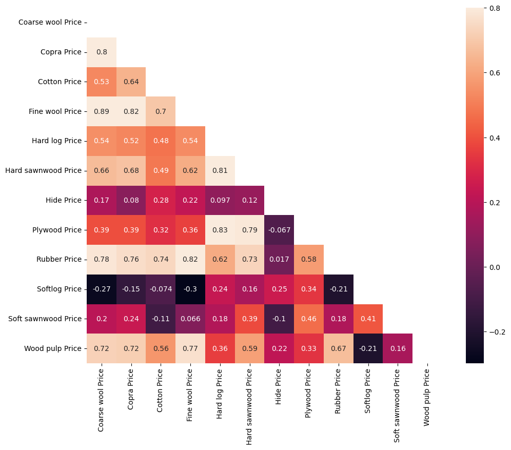
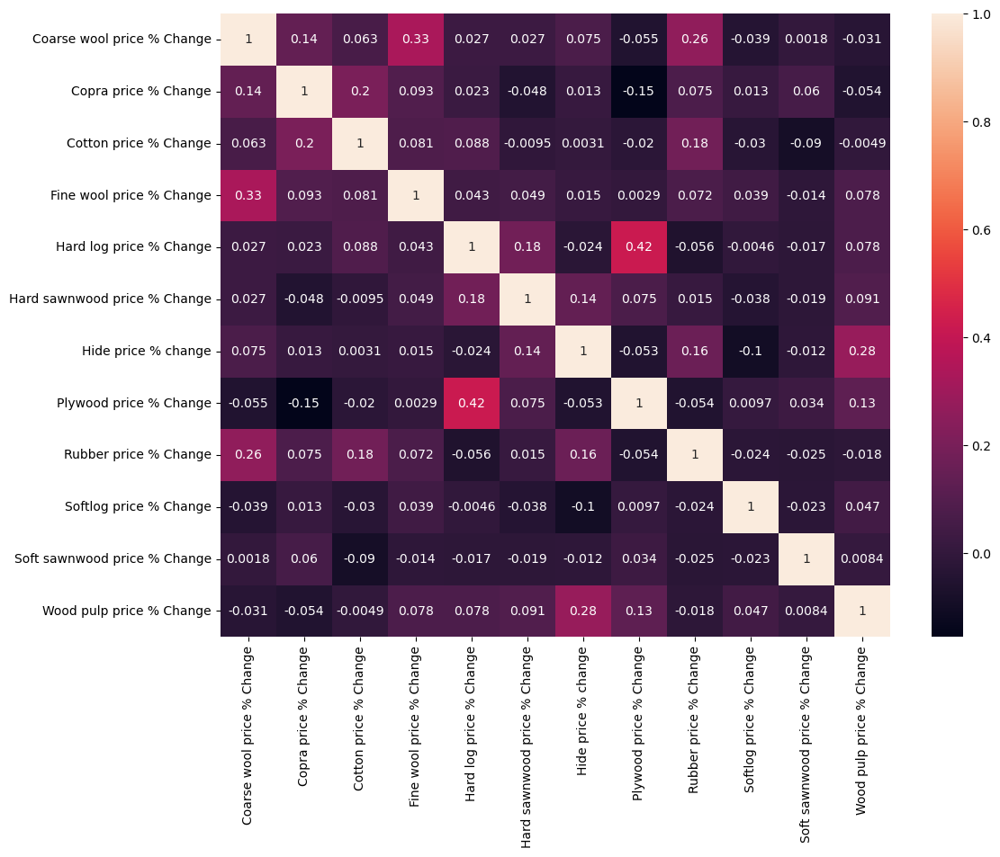

# Preços de Materias Primas Agricolas

Projeto elaborado conforme vídeo tutorial do canal [Data Marketing & AI](https://www.youtube.com/watch?v=Lv-Z2TE-usI)

## Descrição: 
O projeto busca demonstrar na prática os conceitos de **tratamento e análise de dados** utilizando o Python, a partir de uma [Base de Dados da plataforma Kaggle](https://www.kaggle.com/datasets/kianwee/agricultural-raw-material-prices-19902020)

A base de dados contêm os preços de todas as matérias-primas agrículas de 1990 até 2020.

## Bibliotecas Utilizadas: 
 - Pandas
 - Numpy
 - Matplotlib
 - Seaborn

## Melhorias realizadas por mim:

1. Automação da conversão de tipos de dados

    Implementei um loop for que **identifica e armazena** automaticamente as colunas do tipo object para conversão posterior para float.
    
        Motivação: Evitar a digitação manual de todas as colunas, reduzindo erros e ganhando eficiência.

2. Separação Automática entre colunas de Preços (Price) e de Percentual de Variação (% Change)

    Implementei um loop for que **identifica** quais colunas são referentes ao **Preço** da matéria prima e quais são referentes ao **Percentual de Variação**.
    
    O filtro **armazena** as colunas em listas separadas, facilitando a criação de gráficos.

        Motivação: Evitar a digitação manual dessas colunas, reduzindo chances de erros e ganhando eficiênca

## Insights e Visualizações:

### Mapa de Calor dos Preços das Matérias-Primas

 - O preço da Fine wool possui **forte correlação (0.89)** com o preço da Coarse wool

 - O preço da Plywood possui **forte correlação (0.83)** com o da Hard log

### Mapa de Calor do Percentual de Variação das Matérias-Primas

 - **Quase não há correlação** entre a variação percentual dos precos das matérias-primas
  - O valor negativo implica que duas variáveis estão **negativamente** correlacionadas (uma aumenta enquanto a outra diminui)
  - Zero implica nenhuma correlação 

## Links Úteis: 

[Vídeo tutorial da Data Marketing & AI](https://www.youtube.com/watch?v=Lv-Z2TE-usI)
[Base de Dados Original na Kaggle](https://www.kaggle.com/datasets/kianwee/agricultural-raw-material-prices-19902020)

[Plataforma Kaggle](https://www.kaggle.com/)
[Canal Data Marketing & AI](https://www.youtube.com/@DataMarketing)