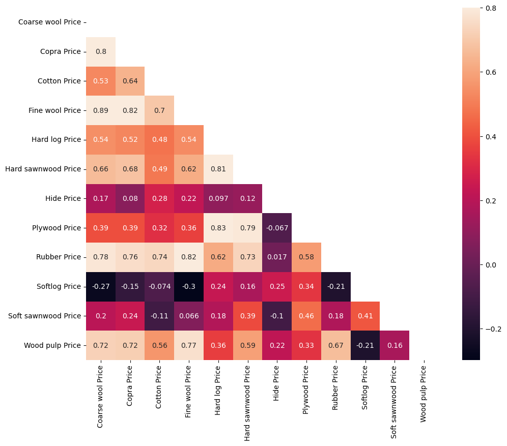
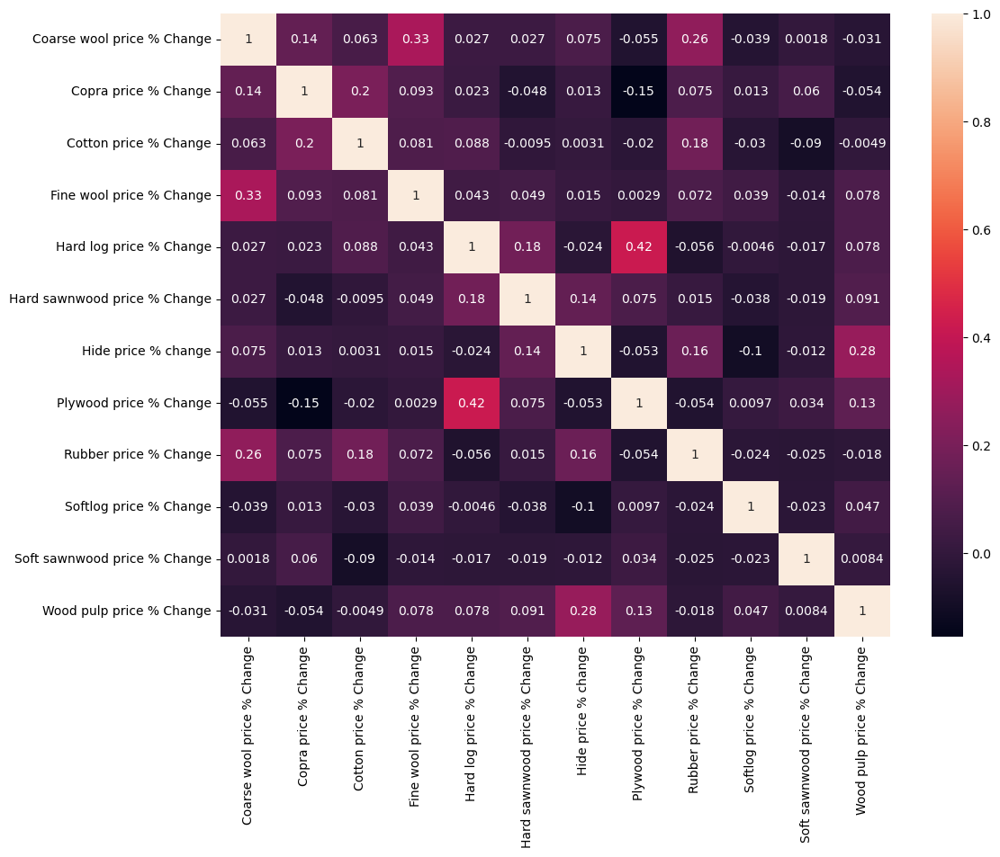
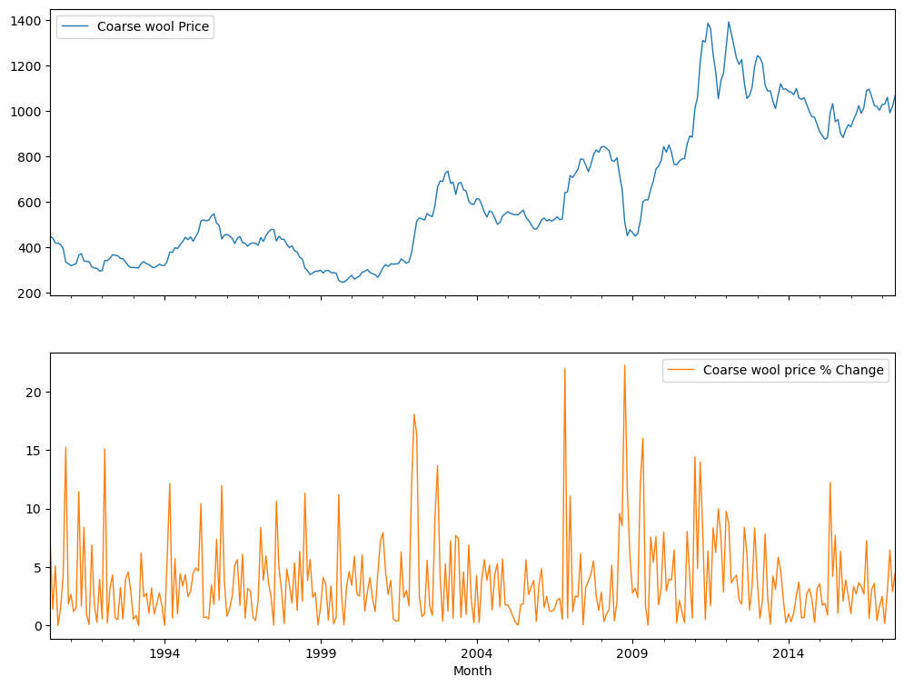
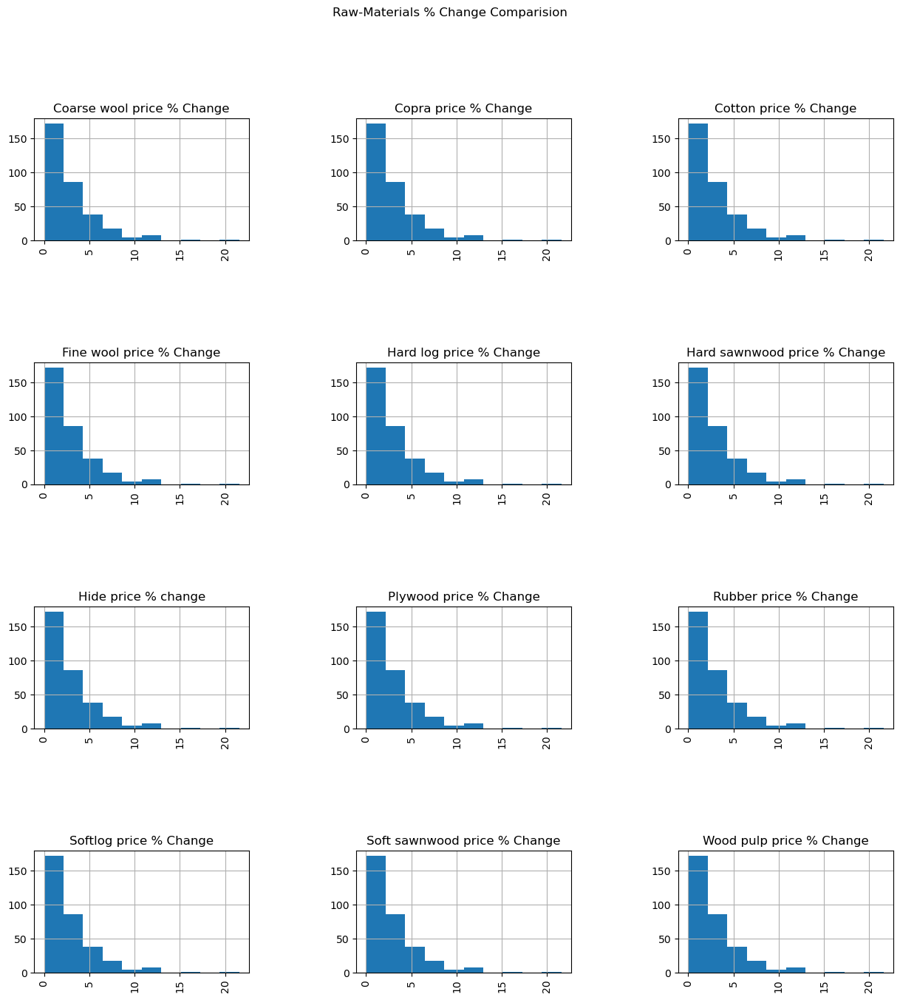
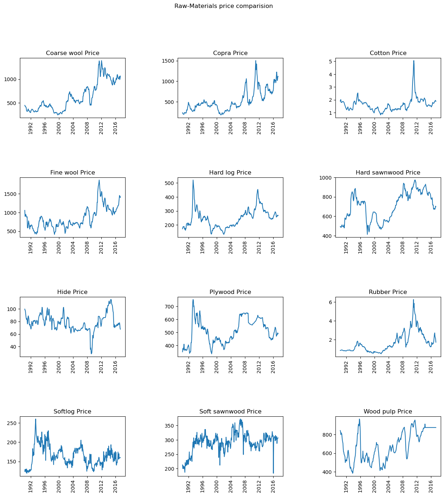
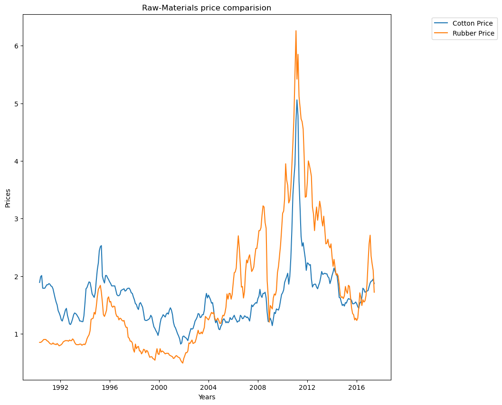
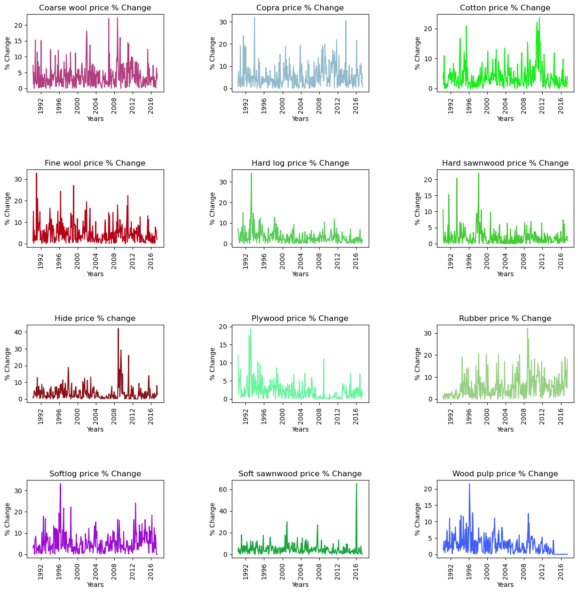
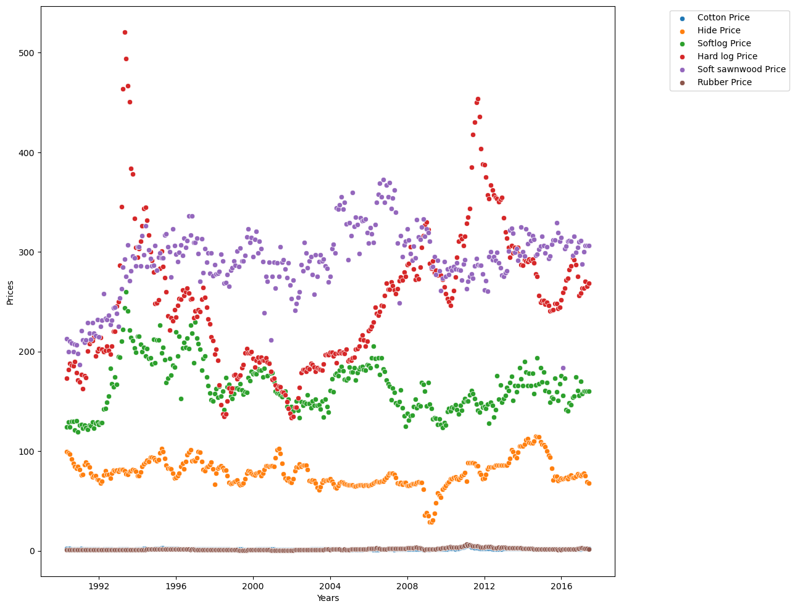
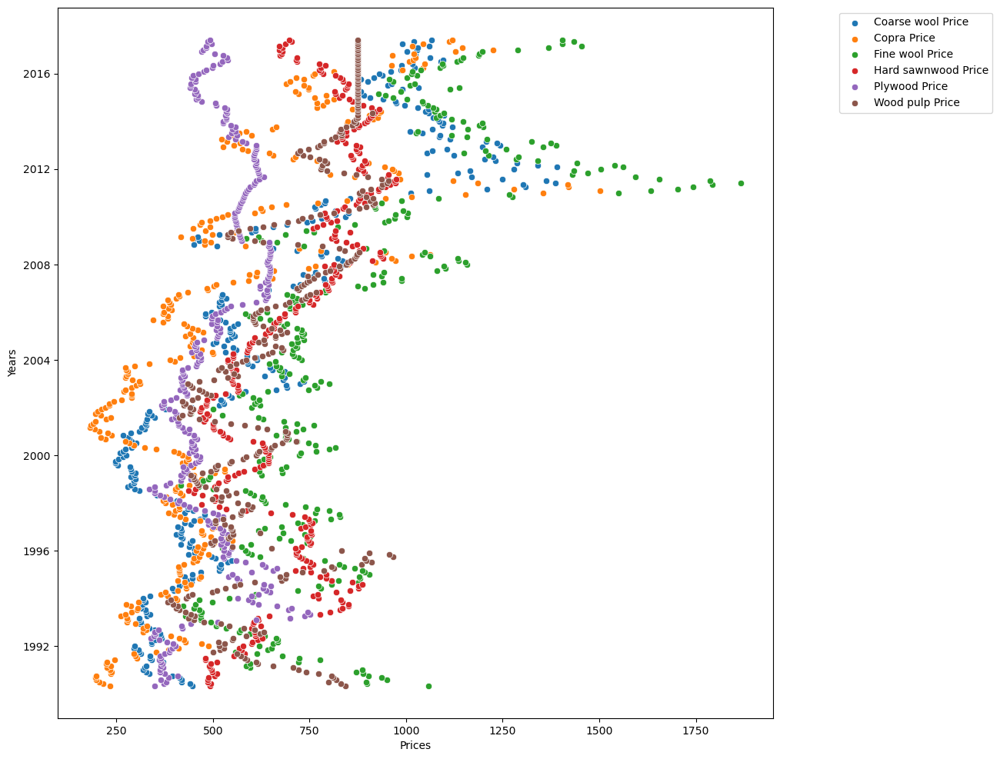
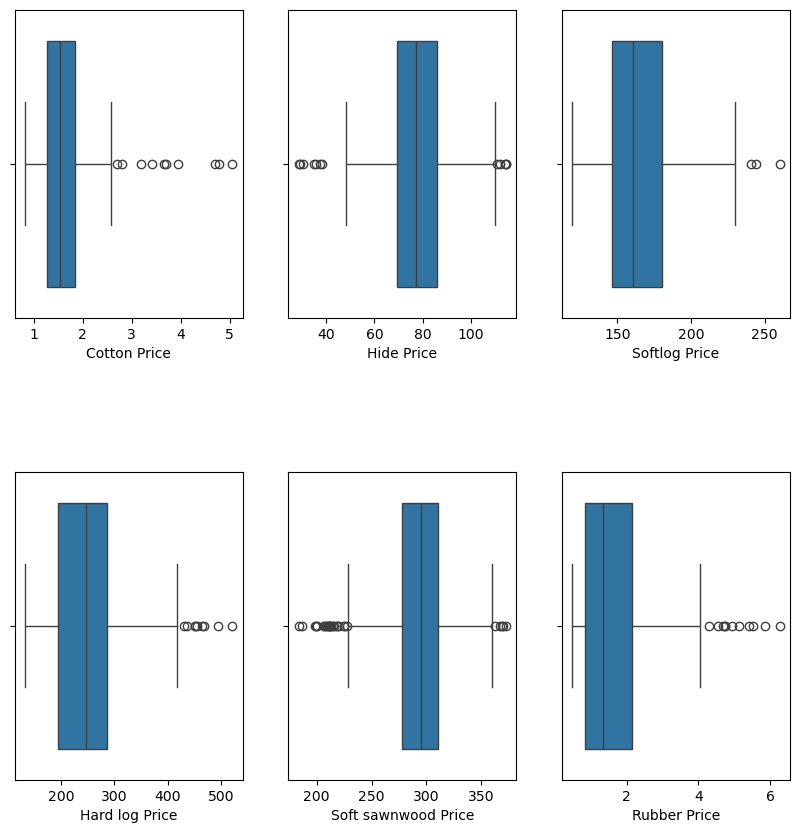

# Preços de Materias Primas Agricolas

Projeto elaborado conforme vídeo tutorial do canal [Data Marketing & AI](https://www.youtube.com/watch?v=Lv-Z2TE-usI)

## Descrição: 
O projeto busca demonstrar na prática os conceitos de **tratamento e análise de dados** utilizando o Python, a partir de uma [Base de Dados da plataforma Kaggle](https://www.kaggle.com/datasets/kianwee/agricultural-raw-material-prices-19902020)

A base de dados contêm os preços de todas as matérias-primas agrículas de 1990 até 2020.

## Bibliotecas Utilizadas: 
 - Pandas
 - Numpy
 - Matplotlib.pyplot
 - Seaborn
 - Random

## Melhorias realizadas por mim:

1. Automação da conversão de tipos de dados

    Implementei um loop for que **identifica e armazena** automaticamente as colunas do tipo object para conversão posterior para float.
    
        Motivação: Evitar a digitação manual de todas as colunas, reduzindo erros e ganhando eficiência.

2. Separação Automática entre colunas de Preços (Price) e de Percentual de Variação (% Change)

    Implementei um loop for que **identifica** quais colunas são referentes ao **Preço** da matéria prima e quais são referentes ao **Percentual de Variação**.
    
    O filtro **armazena** as colunas em listas separadas, facilitando a criação de gráficos.

        Motivação: Evitar a digitação manual dessas colunas, reduzindo chances de erros e ganhando eficiênca

3. Plotagem dos gráficos de comparação de veriação do preço das matérias-primas em uma única figura (pergunta de negócio 1)

    Realizei a plotagem de todos os histogramas (12) de variação das matérias-primas em uma única figura, mantendo a qualidade visual para identificação dos valores e análise posterior
    
    Todos os 12 histogramas estavam sendo gerados separadamente no vídeo explicativo, portanto decidi alterar a plotagem um uma única figura.

        Motivação: Facilitar a comparação dos 12 gráficos com uma única figura, possibilitando a demonstração aqui no README na pergunta de negócio 1

## Insights e Visualizações:

### Mapa de Calor dos Preços das Matérias-Primas

 - O preço da Fine wool possui **forte correlação (0.89)** com o preço da Coarse wool

 - O preço da Plywood possui **forte correlação (0.83)** com o da Hard log

### Mapa de Calor do Percentual de Variação das Matérias-Primas

 - **Quase não há correlação** entre a variação percentual dos precos das matérias-primas
  - O valor negativo implica que duas variáveis estão **negativamente** correlacionadas (uma aumenta enquanto a outra diminui)
  - Zero implica nenhuma correlação 

### Deep Dive - Lã Grossa

 - A porcentagem de variação possui mais aumentos do que quedas, explicando assim o aumento do preço ao longo do tempo

## Perguntas de Negócio:

#### 1: Descubra a variação normal do preço de cada matéria-prima

 - Podemos observar que a **maioria** das matérias-primas tem % de mudança frequente ideal **inferior a 5%**

#### 2: Encontre a matéria-prima que tem o menor preço ao longo dos anos

 - Podemos ver que o **algodão** e a **borracha** são de preços mais baixos

 - **Algodão** é a matéria-prima de menor preço nos últimos anos.

#### 3: Qual matéria-prima tem a maior e menor variação de % de preço

 - Maior % de mudança (mais de 60): Madeira serrada macia

 - Menor % de mundança (menos de 30): Madeira compensada

#### 4: Encontre as matérias-primas com mudança drástica de preço

 - MP de baixo preço: tora dura

 - MP de alto preço: lã fina

#### 5: Descobrir a faixa de preço e matérias-primas de baixo preço

## Inferências e Conclusões:

 - Descoberto as matérias-primas de alta e baixa gama de acordo com seus preços

 - Alta e baixa % de variação das mps

 - Foi possível identificar a variação de preços ao longo dos anos

 - Correlação entre eles usando um mapa de calor

## Trabalho Futuro:

 - Pode ser possível descobrir a relação entre as matérias-primas em detalhes e, com a ajuda do conhecimento de negócio, descobrir as mps mais próximas

 - Também pode-se prever os preços das matérias-primas analisando os anos anteriores

 - Prevendo a variação de preços e com base nisso, pode ser possível planejar o uso de matéria-prima com antecedência para o próximo ano e descobrir quaisquer materiais alternativos

## Links Úteis: 

[Vídeo tutorial da Data Marketing & AI](https://www.youtube.com/watch?v=Lv-Z2TE-usI)

[Base de Dados Original na Kaggle](https://www.kaggle.com/datasets/kianwee/agricultural-raw-material-prices-19902020)

[Plataforma Kaggle](https://www.kaggle.com/)

[Canal Data Marketing & AI](https://www.youtube.com/@DataMarketing)